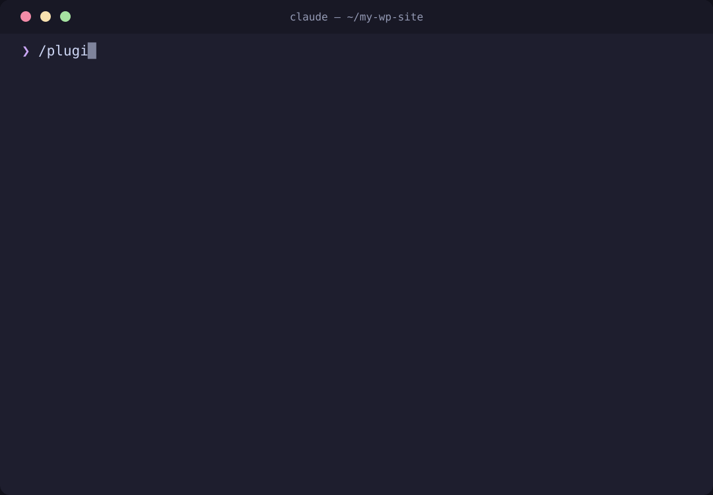

# chomachomachoma-plugins

Chris Choma's public plugin library for [Claude Code](https://claude.com/claude-code) — a Claude Code marketplace with three independent plugins: a WordPress development expert that enforces security, coding-standards, and accessibility rules automatically, a token-efficient documentation assistant that keeps a `docs/` tree in sync with your code as it changes, and a browser-testing harness that visually validates UI work with Playwright screenshots Claude actually looks at.

<p align="center">
  
</p>

## Installation

Add the marketplace once, then install whichever plugin(s) you want — they're fully independent, so pick any combination:

```
/plugin marketplace add chomachomachoma/chomachomachoma-plugins
/plugin install god-tier-wordpress@chomachomachoma-plugins
/plugin install doc-assistant@chomachomachoma-plugins
/plugin install e2e-harness@chomachomachoma-plugins
```

### Local development / testing

To try the marketplace from a local clone instead of GitHub — useful when developing or reviewing changes before they're pushed:

```
/plugin marketplace add /path/to/chomachomachoma-plugins
/plugin install god-tier-wordpress@chomachomachoma-plugins
/plugin install doc-assistant@chomachomachoma-plugins
/plugin install e2e-harness@chomachomachoma-plugins
```

Point `/path/to/chomachomachoma-plugins` at your local checkout of this repo. Everything else works the same as installing from GitHub.

## Plugins

| Plugin | What it does | Components |
|---|---|---|
| [`god-tier-wordpress`](plugins/god-tier-wordpress) | All-knowing WordPress developer for core, theme, and plugin work — auto-loads WordPress-specific knowledge and enforces security, coding-standards, and accessibility rules while you write or review code. | 3 skills (`wordpress-development`, `wordpress-security`, `wordpress-accessibility`), `wp-reviewer` agent (read-only by construction — no Write/Edit tools; Bash for git/grep inspection only), 3 commands (`/wp-review`, `/wp-security-audit`, `/wp-scaffold`) |
| [`doc-assistant`](plugins/doc-assistant) | Token-efficient documentation manager — maintains an indexed `docs/` tree, updates it incrementally from diffs, and reminds you when docs drift from code. | `managing-docs` skill, `doc-manager` agent, 3 commands (`/docs-init`, `/docs-update`, `/docs-check`), Stop/PostToolUse drift-reminder hooks |
| [`e2e-harness`](plugins/e2e-harness) | Browser-testing harness for visual validation — writes and runs Playwright tests, captures screenshots Claude reads before claiming anything works, and grows a persistent `e2e/` regression suite in your project. | `validating-in-browser` skill, 3 commands (`/e2e`, `/e2e-screenshot`, `/e2e-setup`) |

## god-tier-wordpress

An all-knowing WordPress developer for core, theme, and plugin work, built for the WordPress 6.x era (block themes, `theme.json`, `block.json` apiVersion 3). Three skills load automatically based on what you're doing — architecture and block development, the sanitize/validate/escape security model plus nonce and capability checks, and WCAG 2.2 AA accessibility — backed by a dedicated `wp-reviewer` agent and slash commands for on-demand structured reviews.

**Usage examples:**

```
/wp-review
```
Reviews the current diff against WordPress coding standards, security, and accessibility rules, reporting findings by severity.

```
/wp-security-audit includes/class-rest-controller.php
```
Runs a focused security pass over the given file(s): sanitization gaps, missing escaping, missing nonce/capability checks, unsafe `$wpdb` queries, REST endpoints missing `permission_callback`.

```
/wp-scaffold block "Price Tag"
```
Scaffolds a new block (or `plugin`/`theme`, depending on the arguments) following the conventions documented in `wordpress-development`.

You can also skip the commands and just ask normally — e.g. "add a settings page that saves an API key" — and the relevant skill(s) load automatically.

## doc-assistant

A token-efficient documentation manager. Instead of one giant file read in full on every doc-related task, it maintains a `docs/` tree: a cheap `docs/INDEX.md` table of contents plus focused per-area detail files, so an agent reads a few hundred tokens to find what's relevant and then opens only the file(s) that matter. The `doc-manager` agent creates the tree or updates it incrementally from a diff; a companion Stop/PostToolUse hook interrupts the session's stop once per unacknowledged batch of edits with a reminder when code changed but docs didn't — it never edits files, never fails the session, and tells Claude to simply finish if docs are unaffected — and only fires in projects that already have `docs/INDEX.md`.

**Usage examples:**

```
/docs-init
```
Explores the codebase and generates `docs/INDEX.md` plus per-area detail files from scratch.

```
/docs-update
```
Looks at your current diff/staged/untracked changes and updates only the detail files (and index lines) those changes actually affect.

```
/docs-check
```
Read-only drift report — stale, missing, and orphaned docs — makes no edits, and suggests `/docs-update` if it finds drift.

## e2e-harness

A browser-testing harness for visual validation. Claude writes and runs Playwright tests against your running app, captures screenshots at key states, and reads the screenshots before claiming the UI works — a green exit code alone never counts as a visual pass. Specs persist in an `e2e/` directory so each validation grows a regression suite, while a self-contained `e2e/screenshots/.gitignore` keeps every screenshot out of your repo. Screenshot paths are always listed in the final response so you can open the evidence yourself.

**Usage examples:**

```
/e2e signup flow — fill the form and submit
```
Bootstraps Playwright if needed (asking before installing anything), writes or extends `e2e/signup.spec.ts`, runs it against your dev server, reads the captured screenshots, and reports a verdict plus every screenshot's absolute path. With no arguments, `/e2e` infers what to validate from your recent UI changes; add `--headed` to watch the browser live (headless by default).

```
/e2e-screenshot /settings
```
One-off full-page capture of a route in your running app — inspects the image and reports its path, no test file written.

```
/e2e-setup
```
Explicit one-time bootstrap: detects Playwright or Puppeteer, asks which framework to use (recommending Playwright) and which browsers to install, and creates the `e2e/` tree without running a test. Optional — the same setup happens lazily on first `/e2e` run.

You can also skip the commands — after Claude changes UI code, the `validating-in-browser` skill loads automatically when it needs to visually confirm the work.

## Contributing

This is a personal plugin library, but issues and pull requests are welcome — please keep new plugins self-contained under `plugins/<name>/` with their own `.claude-plugin/plugin.json`, and add an entry to `.claude-plugin/marketplace.json`.

## License

MIT — see [LICENSE](LICENSE).
